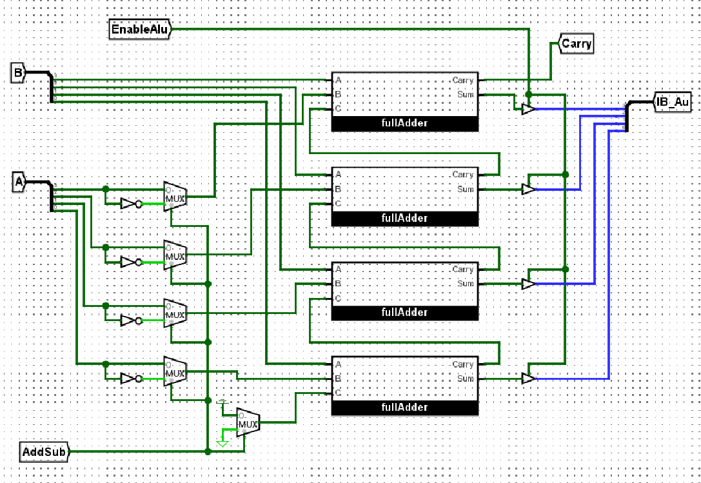
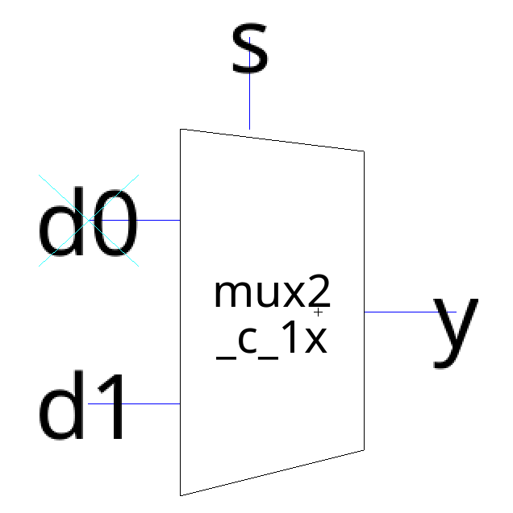
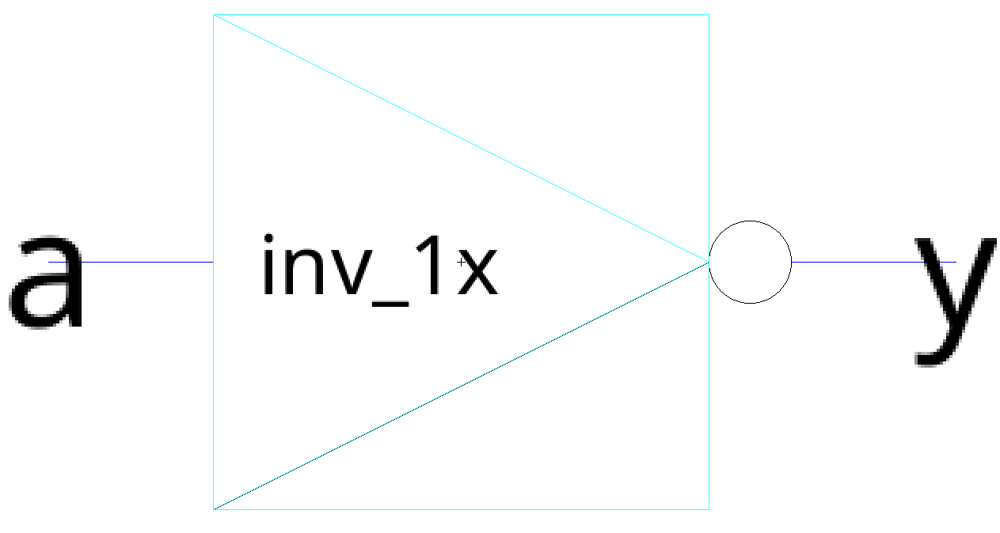
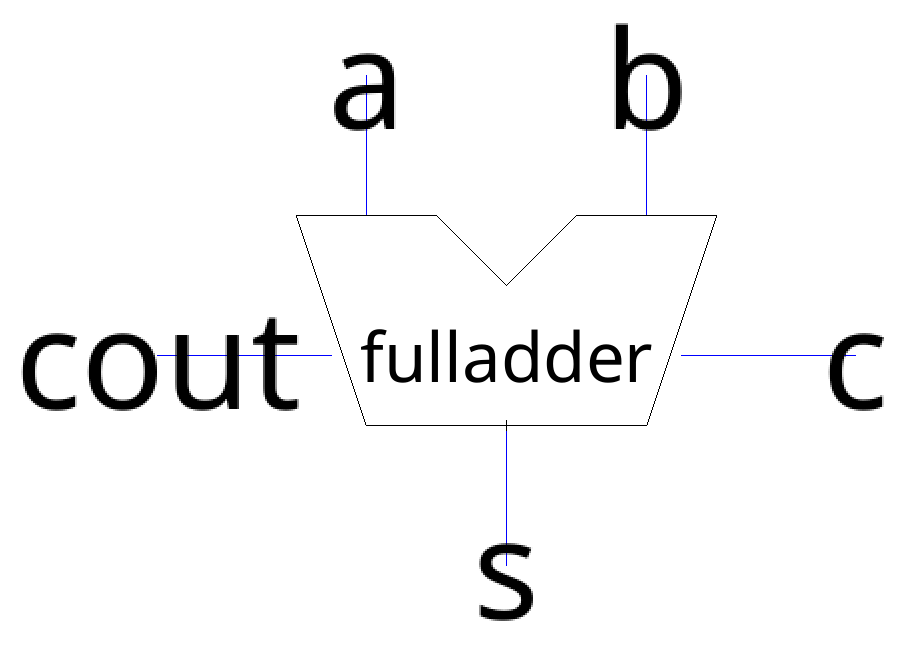
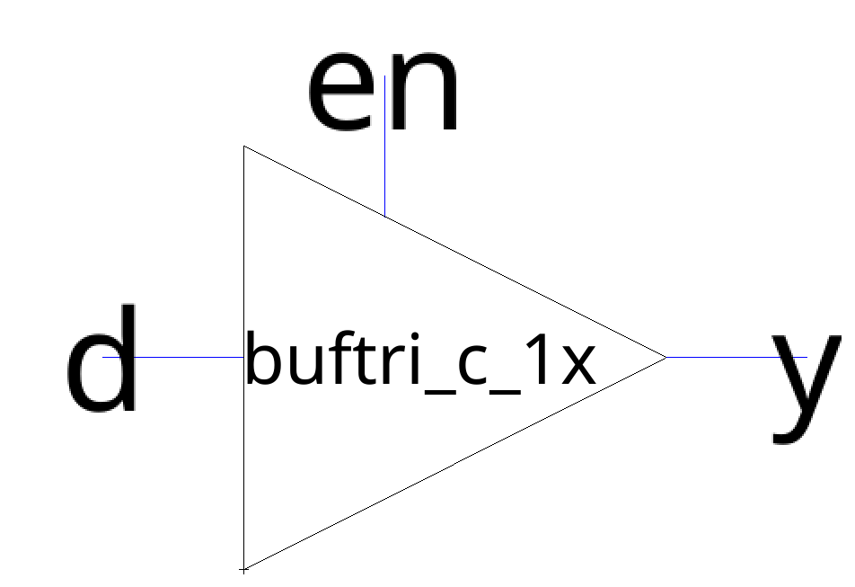

# Arithmetic Logic Unit in Electric VLSI

Cade Thornton

## Introduction

    The goal of this project is to construct an arithmetic logic unit using existing components in electricVLSI according to the schematic given below:

  

  

    Figure 1 (ALU Logism Given Schematic)
  

    The Circuit consists of the following four subcomponents taken from the standard cell library:

  

  

    Figure 2 (Multiplexer)
  

  

  

    Figure 3 (Inverter)
  

  

  

    Figure 4 (FullAdder)
  

  

  

    Figure 5 (Buffer)
  

