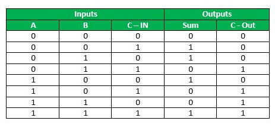

# Arithmetic Logic Unit in Electric VLSI

Cade Thornton

## Introduction

<p align="center">
    The goal of this project is to construct an arithmetic logic unit using existing components in electricVLSI according to the schematic given below:
<p>

<p align="center">
  
</p>

<div align="center">
  <p style="font-size: small;">
    Figure 1 (ALU Logism Given Schematic)
  </p>
</div>

<p align="center">
    The Circuit consists of the following four subcomponents taken from the standard cell library:
<p>

<p align="center">
  
</p>

<div align="center">
  <p style="font-size: small;">
    Figure 2 (Multiplexer)
  </p>
</div>

<p align="center">
  
</p>

<div align="center">
  <p style="font-size: small;">
    Figure 3 (Inverter)
  </p>
</div>

<p align="center">
  
</p>

<div align="center">
  <p style="font-size: small;">
    Figure 4 (FullAdder)
  </p>
</div>

<p align="center">
  
</p>

<div align="center">
  <p style="font-size: small;">
    Figure 5 (Buffer)
  </p>
</div>

## Full Adder

<p align="center">
    The full adder is taken from the standard library:
<p>

<p align="center">
  
</p>

<div align="center">
  <p style="font-size: small;">
    Figure 6 (ALU Logism Given Schematic)
  </p>
</div>

<p align="center">
  
</p>

<div align="center">
  <p style="font-size: small;">
    Figure 7 (Full Adder Truth Table)
  </p>
</div>

<p align="center">
    The design was simulated with the following spice code:
<p>

```
vdd vdd 0 dc 5
a a 0 pulse(0v 5v 0n 1n 1n 10n 20n)
a b 0 pulse(0v 5v 3n 1n 1n 10n 20n) 
c c 0 pulse(0v 5v 6n 1n 1n 10n 20n)
.tran 0 60n
```

<p align="center">
    Which produced the appropriate waveform:
<p>

<p align="center">
  
</p>

<div align="center">
  <p style="font-size: small;">
    Figure 8 (Full Adder Truth Table)
  </p>
</div>

<p align="center">
    And here is the layout with its corresponding simulation and waveform
<p>

<p align="center">
  
</p>

<div align="center">
  <p style="font-size: small;">
    Figure 9 (Full Adder Layout simulation)
  </p>
</div>

## ALU

The ALU operates by performing operations on 8 bit binary numbers and using a series of multiplexers to convert a chosen number to its complement in order to perform subtraction 

<p align="center">
  
</p>

<div align="center">
  <p style="font-size: small;">
    Figure 10 (Full Adder ElectricVLSI schematic)
  </p>
</div>

<p align="center">
  
</p>

<div align="center">
  <p style="font-size: small;">
    Figure 11 (Full Adder ElectricVLSI schematic icon)
  </p>
</div>


